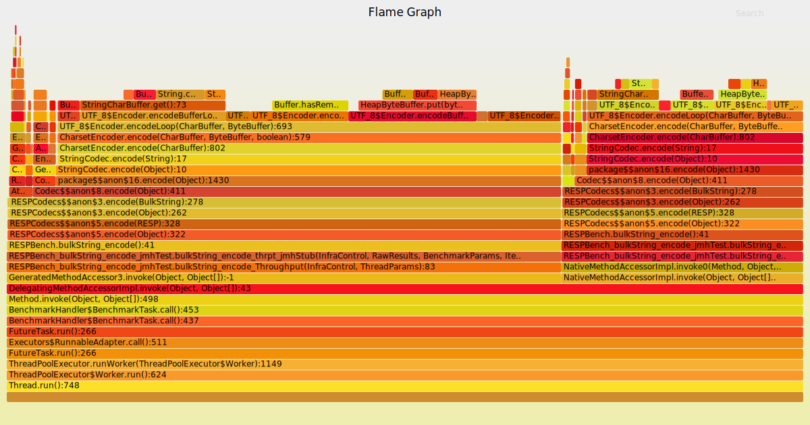
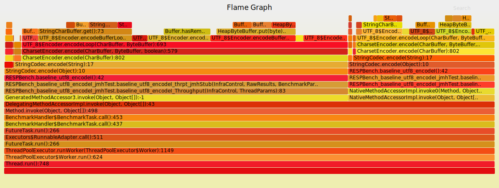
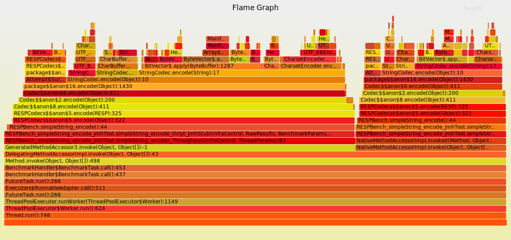

## More on charsets... _(11 May 2018)_
Added a benchmark to pinpoint differences in pure raw performance between `StandardCharsets.UTF_8.encode(s:String): ByteBuffer`
(used by `scodec.codecs.utf8`) and `(s: String).getBytes(StandardCharsets.UTF_8): Array[Byte]`.

Also interesting to see the reciprocal, i.e. `(StandardCharsets.UTF_8.decode(bb: ByteBuffer): CharBuffer).toString`
vs `new String(b: Array[Byte], StandardCharsets.UTF_8)`.

Also, implemented [LenientStringCodec](https://github.com/laserdisc-io/laserdisc/tree/master/protocol/src/main/scala/laserdisc/protocol/LenientStringCodec.scala)
to prove whether handling UTF8 encoding/decoding as the former of the two (i.e. lenient w.r.t. malformed/invalid data
_and_ leveraging underlying `System.arrayCopy` always) would lead to overall better performance.

```bash
sbt:laserdisc> cd protocol-benchmarks
sbt:protocol-bench> jmh:run -i 20 -wi 10 -f2 -t1 .*UTF8.*

[info] Benchmark                                               Mode  Cnt         Score        Error  Units
[info] UTF8EncodingBench.decode_long_string_baseline_charset  thrpt   40    681609.456 ±   4618.627  ops/s
[info] UTF8EncodingBench.decode_long_string_baseline_string   thrpt   40   1014156.061 ±   6055.819  ops/s
[info] UTF8EncodingBench.decode_long_string_default_utf8      thrpt   40    588797.370 ±   2722.294  ops/s
[info] UTF8EncodingBench.decode_long_string_lenient_utf8      thrpt   40    816049.009 ±   4034.696  ops/s
[info] UTF8EncodingBench.decode_ok_baseline_charset           thrpt   40  17878620.315 ± 120801.187  ops/s
[info] UTF8EncodingBench.decode_ok_baseline_string            thrpt   40  29110641.894 ± 226674.439  ops/s
[info] UTF8EncodingBench.decode_ok_default_utf8               thrpt   40  10759072.941 ± 113434.374  ops/s
[info] UTF8EncodingBench.decode_ok_lenient_utf8               thrpt   40  12396142.937 ±  75330.784  ops/s
[info] UTF8EncodingBench.encode_long_string_baseline_charset  thrpt   40    228850.537 ±    994.737  ops/s
[info] UTF8EncodingBench.encode_long_string_baseline_string   thrpt   40    830896.958 ±   5961.262  ops/s
[info] UTF8EncodingBench.encode_long_string_default_utf8      thrpt   40    217622.095 ±   1312.185  ops/s
[info] UTF8EncodingBench.encode_long_string_lenient_utf8      thrpt   40    818939.332 ±   4016.609  ops/s
[info] UTF8EncodingBench.encode_ok_baseline_charset           thrpt   40  21983610.584 ± 189013.347  ops/s
[info] UTF8EncodingBench.encode_ok_baseline_string            thrpt   40  23865417.974 ± 170500.956  ops/s
[info] UTF8EncodingBench.encode_ok_default_utf8               thrpt   40  13551775.934 ±  82189.299  ops/s
[info] UTF8EncodingBench.encode_ok_lenient_utf8               thrpt   40  18988721.230 ± 113320.436  ops/s
```

This is quite promising, it looks like our new codec is closer to baseline best performance than `Scodec`'s, also it
appears that it beats baseline's ByteBuffer's long string encoding/decoding.

What follows is the benchmark on `Codec[RESP]` after swapping UTF8 codec:
```bash
sbt:laserdisc> cd protocol-benchmarks
sbt:protocol-bench> jmh:run -i 20 -wi 10 -f2 -t1 .*RESPBench.*

[info] Benchmark                         Mode  Cnt         Score        Error  Units
[info] RESPBench.baseline_utf8_decode   thrpt   40    586764.974 ±   5038.563  ops/s
[info] RESPBench.baseline_utf8_decodeI  thrpt   40    589099.238 ±   3715.503  ops/s
[info] RESPBench.baseline_utf8_encode   thrpt   40    217015.042 ±   1349.796  ops/s
[info] RESPBench.baseline_utf8_encodeI  thrpt   40    218071.397 ±   1094.907  ops/s
[info] RESPBench.bulkString_decode      thrpt   40    432141.362 ±   3520.454  ops/s
[info] RESPBench.bulkString_encode      thrpt   40    720834.209 ±   3055.016  ops/s
[info] RESPBench.error_decode           thrpt   40    673011.802 ±  12557.678  ops/s
[info] RESPBench.error_encode           thrpt   40   9749003.374 ± 282563.535  ops/s
[info] RESPBench.integer_decode         thrpt   40   1415915.082 ±  24965.637  ops/s
[info] RESPBench.integer_encode         thrpt   40   9622437.551 ± 231010.857  ops/s
[info] RESPBench.simpleString_decode    thrpt   40   2005482.712 ±  67972.508  ops/s
[info] RESPBench.simpleString_encode    thrpt   40   9792709.937 ±  83026.183  ops/s
```

Aside for the fact that we pretty much bumped upwards all figures, we managed to significantly increase `BulkString`
encoding raw performance to being _~13 times_ slower than `SimpleString` encoding, which is way more acceptable than
before (also remembering that `SimpleString` is encoding a string 1000 smaller in length).

**Huzzah!**

## On charsets... _(08 May 2018)_
Now that decoding is faster, let's try and figure out what is going on
with encoding. This seems to be our new bottleneck.

To measure its performance, we added baseline performance of the underlying codec
used: [scodec.codecs.utf8](https://github.com/scodec/scodec/blob/v1.10.3/shared/src/main/scala/scodec/codecs/package.scala#L532)

To further ensure we were not hampering our original scenario (and our baseline) by using `String`s that were constructed
upon class instantiation via new object creation we added string [interns](https://docs.oracle.com/javase/specs/jls/se7/html/jls-3.html#jls-3.10.5)
in the mix (the `encodeI` method)

Another run of jmh (_upgraded to latest 1.21_) revealed that
```bash
sbt:laserdisc> cd protocol-benchmarks
sbt:protocol-bench> jmh:run -i 20 -wi 10 -f2 -t1 .*RESPBench.b.*encode

[info] REMEMBER: The numbers below are just data. To gain reusable insights, you need to follow up on
[info] why the numbers are the way they are. Use profilers (see -prof, -lprof), design factorial
[info] experiments, perform baseline and negative tests that provide experimental control, make sure
[info] the benchmarking environment is safe on JVM/OS/HW level, ask for reviews from the domain experts.
[info] Do not assume the numbers tell you what you want them to tell.
[info] Benchmark                         Mode  Cnt       Score      Error  Units
[info] RESPBench.baseline_utf8_encode   thrpt   40  216589.943 ± 1207.118  ops/s
[info] RESPBench.baseline_utf8_encodeI  thrpt   40  217304.295 ±  463.766  ops/s
[info] RESPBench.bulkString_encode      thrpt   40  206098.693 ±  417.478  ops/s
```

This means that indeed `BulkString` encoding is slow, but not more than `~5%` slower than bare `scodec.codecs.utf8`'s
**for the same data**. Also, this reveals that indeed intern string encoding is slightly faster, as expected.

One now may ask: is SimpleString encoding doing something dramatically different that the rest given that it is
_~30 times_ faster?

Let's [flame-graph](https://github.com/brendangregg/FlameGraph) them all!

### BulkString


### Baseline (scodec.codecs.utf8)


### SimpleString


Ok, so, what's there? All of these share pretty much the same code path, from going through `scodec.codecs.StringCodec.encode`
through `java.nio.charset.CharsetEncoder.encode` ultimately to `sun.nio.cs.UTF_8$Encoder.encodeLoop` and
`sun.nio.cs.UTF_8$Encoder.encodeBufferLoop`.

The difference is the **time spent** in those, which accounts for **>63% in `BulkString` and `Baseline` cases** and
**only 6% in `SimpleString`'s case**!!

In `SimpleString`'s case the string converted to `UTF-8` is `OK`, whilst in `BulkString` and `Baseline` its a string of
length `2000` repeating the character `a`.
It appears that a `1000` factor increase in string length produces approximately a `30` factor reduction in throughput...
bummer!

Next: see what can be done to optimise UTF8 encoding...

## Results after first optimisation round _(05 May 2018)_

```bash
sbt:laserdisc> cd protocol-benchmarks
sbt:protocol-bench> jmh:run -i 20 -wi 10 -f2 -t1 .*

[info] Benchmark                       Mode  Cnt        Score        Error  Units
[info] ProtocolBench.decode           thrpt   40  4657288.663 ±  81320.290  ops/s
[info] ProtocolBench.encode           thrpt   40  4380152.108 ±  49000.048  ops/s
[info] RESPBench.bulkString_decode    thrpt   40   338781.141 ±   5180.365  ops/s
[info] RESPBench.bulkString_encode    thrpt   40   201540.665 ±   1443.579  ops/s
[info] RESPBench.error_decode         thrpt   40   635168.747 ±   8633.595  ops/s
[info] RESPBench.error_encode         thrpt   40  5023689.984 ±  86893.815  ops/s
[info] RESPBench.integer_decode       thrpt   40  1380625.705 ±  13065.164  ops/s
[info] RESPBench.integer_encode       thrpt   40  7251347.150 ± 183302.953  ops/s
[info] RESPBench.simpleString_decode  thrpt   40  1849976.081 ±  44952.587  ops/s
[info] RESPBench.simpleString_encode  thrpt   40  6375721.979 ±  46999.275  ops/s
[info] RESPParamWriteBench.write      thrpt   40  9591938.499 ± 314472.561  ops/s
```

## Initial results _(04 May 2018)_

```bash
sbt:laserdisc> cd protocol-benchmarks
sbt:protocol-bench> jmh:run -i 20 -wi 10 -f2 -t1 .*

[info] Benchmark                       Mode  Cnt        Score        Error  Units
[info] ProtocolBench.decode           thrpt   40  4415274.330 ±  62501.103  ops/s
[info] ProtocolBench.encode           thrpt   40  4093451.944 ±  68472.615  ops/s
[info] RESPBench.bulkString_decode    thrpt   40      316.769 ±      9.826  ops/s
[info] RESPBench.bulkString_encode    thrpt   40   161260.084 ±   4011.619  ops/s
[info] RESPBench.error_decode         thrpt   40    33473.536 ±    677.165  ops/s
[info] RESPBench.error_encode         thrpt   40  5390220.406 ± 493286.825  ops/s
[info] RESPBench.integer_decode       thrpt   40   206950.255 ±   5283.544  ops/s
[info] RESPBench.integer_encode       thrpt   40  6658282.051 ±  98604.929  ops/s
[info] RESPBench.simpleString_decode  thrpt   40   220737.683 ±   4632.795  ops/s
[info] RESPBench.simpleString_encode  thrpt   40  5707122.965 ± 276588.267  ops/s
[info] RESPParamWriteBench.write      thrpt   40  6886022.467 ± 243744.210  ops/s
```

Results "seem" to indicate that decoding is _sloooooow_ :)

In particular, BulkString decoding is extremely slow.

Considering that most of Redis' responses are Arrays of BulkStrings... and we're not yet even microbenchmarking Arrays yet...
